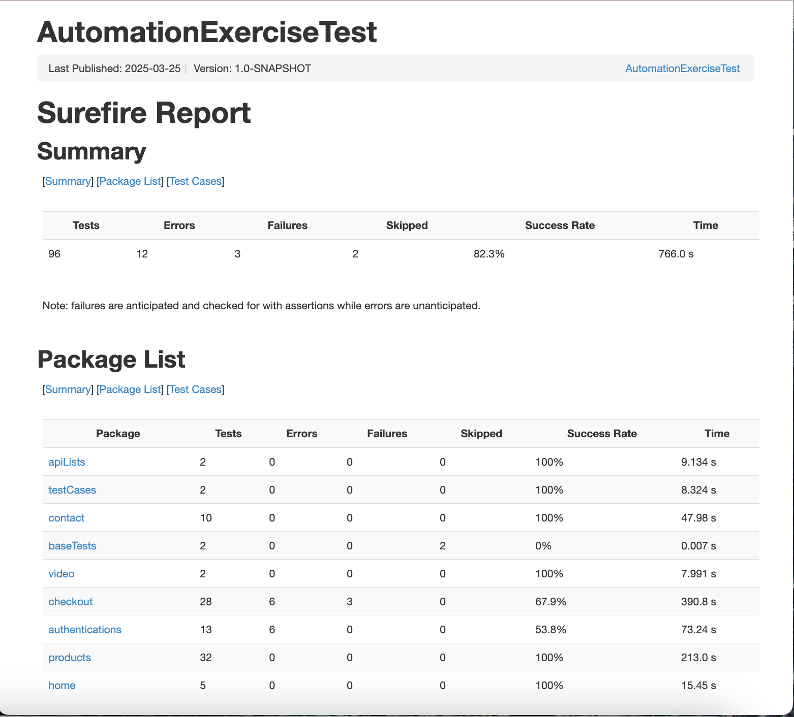

# Automation Exercise Test Automation

## Description
The **Automation Exercise Test Automation** project uses Java, Selenium, Maven, and JUnit to write automation test scripts for end-to-end testing of the [Automation Exercise website](https://automationexercise.com/). This project covers comprehensive test cases for all pages, including the footer section, ensuring robust functionality verification.

## Purpose
The primary purpose of this project is to perform end-to-end testing of the Automation Exercise website to verify its functionality and reliability.

## Test Results Summary

*Generated on 2025-03-25 | Success Rate: 82.3%*

Here's a summary of the latest test execution:

| Category         | Tests | Errors | Failures | Skipped | Success Rate | Time     |
|------------------|-------|--------|----------|---------|--------------|----------|
| **Total**        | 96    | 12     | 3        | 2       | 82.3%        | 766.0 s  |
| apiLists         | 2     | 0      | 0        | 0       | 100%         | 9.134 s  |
| testCases        | 2     | 0      | 0        | 0       | 100%         | 8.324 s  |
| contact          | 10    | 0      | 0        | 0       | 100%         | 47.98 s  |
| video            | 2     | 0      | 0        | 0       | 100%         | 7.991 s  |
| checkout         | 28    | 6      | 3        | 0       | 67.9%        | 390.8 s  |
| authentications  | 13    | 6      | 0        | 0       | 53.8%        | 73.24 s  |
| products         | 32    | 0      | 0        | 0       | 100%         | 213.0 s  |
| home             | 5     | 0      | 0        | 0       | 100%         | 15.45 s  |

### Key Findings:
- 82.3% overall success rate (79 passed out of 96 tests)
- Main issues in checkout and authentication tests

### Error Analysis:
Most errors were `NoSuchElementException`, indicating elements weren't found when expected. This suggests potential timing issues or changes in the application's UI structure.

### Full Test Reports
[View Latest Test Results](https://abiolaah.github.io/AutomationExerciseTest/)

## Viewing Full Test Report
To view the complete HTML test report with detailed error information:

1. Run the tests if you haven't already:
   ```bash
   mvn test
2. Open the generated report in your browser:
      ```bash
      open target/report/surefire-report.html

## Screenshots

*Figure 1: Screenshot of Test case Page tests*

*Figure 2: Screenshot of API List Page tests*

## Core Functionality
- Test scripts were written to cover all pages of the website. 
- Additional tests ensure the functionality and consistency of the footer section.

## Technologies Used
The project is built using the following tools and libraries:
- Java: Programming language for the test scripts. 
- Selenium: Browser automation framework. 
- JUnit: Framework for writing and running test cases. 
- Maven: Dependency management and build automation. 
- WebDriverManager: Automated management of browser drivers. 
- JavaFaker: Generating random test data. 
- Hamcrest: Writing expressive test assertions. 
- Jackson: Handling JSON data. 
- Gson: Gives access to the Gson class, which is a powerful tool for handling JSON serialization and deserialization in Java. In this project, it simplifies reading and writing JSON data, ensuring smooth interaction between JSON files and your Java application.
Dependencies are managed via Maven. The relevant dependencies are specified in the pom.xml file (shown below).

## Project Setup
To set up and run the project locally, follow these steps:

### Prerequisites
Ensure the following are installed:
- Java Development Kit (JDK) 11 or higher.
- Maven (Apache Maven 3.6.3 or later is recommended).

### Steps
1. Clone the repository:
   ```bash
   git clone https://github.com/abiolaah/AutomationExerciseTest.git
   cd AutomationExerciseTest
2. Install Dependencies
    ```bash
   mvn clean install
3. Run the tests
   ```bash
   mvn test

## Project Structure
The repository is organized as follows:
- **src/main/java/pages**: Contains the Page Object Model for the tests.
- **src/main/java/utils**: Contains the additional functions to help with the testing.
- **src/test/java**: Contains all test scripts for the website's pages and footer.
- **pom.xml**: Maven configuration file for dependencies and project settings.

## Contributions
Contributions are welcome! If you encounter any issues or have suggestions for improvements, feel free to submit a pull request or open an issue in the repository

## License
This project is licensed under the MIT License. See the LICENSE file for more details.


**Enjoy testing the Automation Exercise website!**