# Automation Exercise Test Automation

## Description
The **Automation Exercise Test Automation** project uses Java, Selenium, Maven, and JUnit to write automation test scripts for end-to-end testing of the [Automation Exercise website](https://automationexercise.com/). This project covers comprehensive test cases for all pages, including the footer section, ensuring robust functionality verification.

## Purpose
The primary purpose of this project is to perform end-to-end testing of the Automation Exercise website to verify its functionality and reliability.

## Core Functionality
- Test scripts were written to cover all pages of the website
- Additional tests ensure the functionality and consistency of the footer section
- Comprehensive reporting with screenshots for visual verification

## Technologies Used
| Technology | Purpose |
|------------|---------|
| Java | Programming language for test scripts |
| Selenium | Browser automation framework |
| JUnit | Test case framework |
| Maven | Dependency management |
| WebDriverManager | Browser driver management |
| JavaFaker | Test data generation |
| Hamcrest | Assertion library |
| Jackson | JSON processing |
| Gson | JSON serialization |


## Project Setup
To set up and run the project locally, follow these steps:

### Prerequisites
Ensure the following are installed:
- Java Development Kit (JDK) 11 or higher.
- Maven (Apache Maven 3.6.3 or later is recommended).

### Steps
1. Clone the repository:
   ```bash
   git clone https://github.com/abiolaah/AutomationExerciseTest.git
   cd AutomationExerciseTest
2. Install Dependencies
    ```bash
   mvn clean install
3. Run the tests
   ```bash
   mvn test

## Project Structure

```text
AutomationExerciseTest/
│
├── docs/
│   ├── css/
│   ├── images/
│   ├── ide-reports/
│   │   ├── first-ide-run.html
│   │   ├── second-ide-run.html
│   │   └── third-ide-run.html
│   ├── mvn-reports/
│   │   └── first-surefire.html
│   └── index.html
│
├── src/
│   ├── main/
│   │   ├── java/
│   │   │   ├── pages/          # Page Object classes
│   │   │   └── utils/          # Utility classes
│   │   └── resources/
│   │       ├── data/           # Test data files
│   │       ├── download/       # Downloaded test files
│   │       ├── screenshot/     # Test screenshots
│   │       ├── screenshots/    # Additional screenshots
│   │       ├── upload/         # Files for upload tests
│   │       ├── api_lists.json  # API test data
│   │       └── test_cases.json # Test case data
│   │
│   └── test/
│       └── java/               # Test source files
│
├── pom.xml                     # Maven configuration
└── README.md                   # Project documentation
```
## Test Results

### Third Maven Report
[Third Maven Run Report Summary](https://abiolaah.github.io/AutomationExerciseTest/mvn-reports/second-surefire.html)
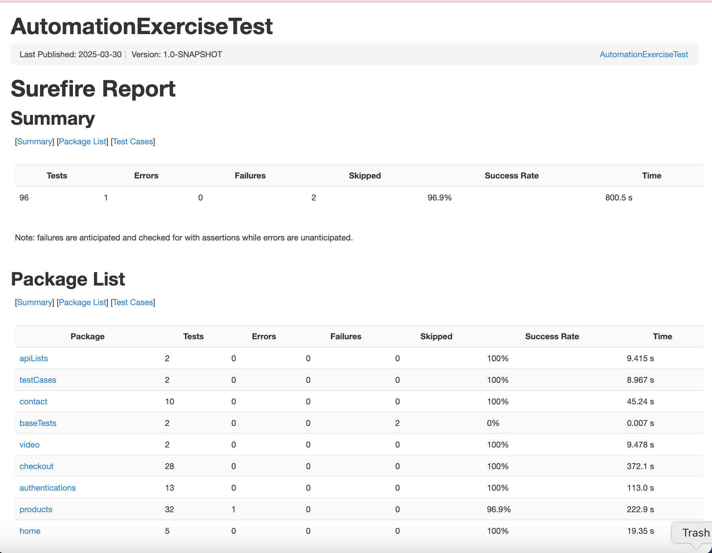
*Third execution report from MVN Command Line*
**Statistics:**
- **Total Tests:** 96
- **Success Rate:** 96.9%
- **Execution Time:** 800.5s

| Category        | Tests | Errors | Failures | Skipped | Success Rate | Time    |
|-----------------|-------|--------|----------|---------|--------------|---------|
| **Total**       | 96    | 1      | 0        | 2       | 96.9%        | 800.5 s |
| apiLists        | 2     | 0      | 0        | 0       | 100%         | 9.415 s |
| testCases       | 2     | 0      | 0        | 0       | 100%         | 8.967 s |
| contact         | 10    | 0      | 0        | 0       | 100%         | 45.24 s |
| baseTests       | 2     | 0      | 0        | 2       | 0%           | 0.007 s |
| video           | 2     | 0      | 0        | 0       | 100%         | 9.478 s |
| checkout        | 28    | 6      | 3        | 0       | 100%         | 372.1 s |
| authentications | 13    | 6      | 0        | 0       | 100%         | 113.0 s |
| products        | 32    | 0      | 0        | 0       | 96.9%        | 222.9 s |
| home            | 5     | 0      | 0        | 0       | 100%         | 19.35 s |

**Key Findings:**
- 96.9% overall success rate (95 passed out of 96 tests)
- Main issues in products tests

**Error Analysis:**
Most errors were `ElementClickInterceptedException`, indicating elements weren't found when expected. This suggests potential timing issues or changes in the application's UI structure.

### Second Maven Report
[Second Maven Run Report Summary](https://abiolaah.github.io/AutomationExerciseTest/mvn-reports/second-surefire.html)

*Second execution report from MVN Command Line*
**Statistics:**
- **Total Tests:** 96
- **Success Rate:** 96.9%
- **Execution Time:** 800.5s

| Category        | Tests | Errors | Failures | Skipped | Success Rate | Time    |
|-----------------|-------|--------|----------|---------|--------------|---------|
| **Total**       | 96    | 1      | 0        | 2       | 96.9%        | 800.5 s |
| apiLists        | 2     | 0      | 0        | 0       | 100%         | 9.415 s |
| testCases       | 2     | 0      | 0        | 0       | 100%         | 8.967 s |
| contact         | 10    | 0      | 0        | 0       | 100%         | 45.24 s |
| baseTests       | 2     | 0      | 0        | 2       | 0%           | 0.007 s |
| video           | 2     | 0      | 0        | 0       | 100%         | 9.478 s |
| checkout        | 28    | 6      | 3        | 0       | 100%         | 372.1 s |
| authentications | 13    | 6      | 0        | 0       | 100%         | 113.0 s |
| products        | 32    | 0      | 0        | 0       | 96.9%        | 222.9 s |
| home            | 5     | 0      | 0        | 0       | 100%         | 19.35 s |

**Key Findings:**
- 96.9% overall success rate (95 passed out of 96 tests)
- Main issues in products tests

**Error Analysis:**
Most errors were `ElementClickInterceptedException`, indicating elements weren't found when expected. This suggests potential timing issues or changes in the application's UI structure.

### First Maven Report
[First Maven Run Report Summary](https://abiolaah.github.io/AutomationExerciseTest/mvn-reports/first-surefire.html)
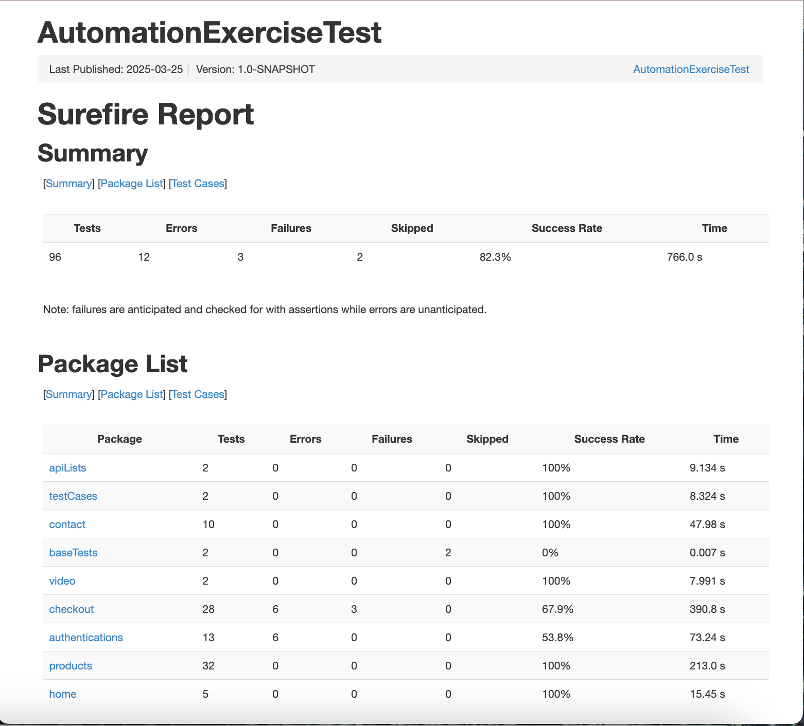
*First execution report from MVN Command Line*
**Statistics:**
- **Total Tests:** 96
- **Success Rate:** 82.3%
- **Execution Time:** 766.0s

| Category          | Tests | Errors | Failures | Skipped | Success Rate | Time      |
|-------------------|-------|--------|----------|---------|--------------|-----------|
| **Total**         | 96    | 12     | 3        | 2       | 82.3%        | 766.0 s   |
| apiLists          | 2     | 0      | 0        | 0       | 100%         | 9.134 s   |
| testCases         | 2     | 0      | 0        | 0       | 100%         | 8.324 s   |
| contact           | 10    | 0      | 0        | 0       | 100%         | 47.98 s   |
| baseTests         | 2     | 0      | 0        | 2       | 0%           | 0.007 s   |
| video             | 2     | 0      | 0        | 0       | 100%         | 7.991 s   |
| checkout          | 28    | 6      | 3        | 0       | 67.9%        | 390.8 s   |
| authentications   | 13    | 6      | 0        | 0       | 53.8%        | 73.24 s   |
| products          | 32    | 0      | 0        | 0       | 100%         | 213.0 s   |
| home              | 5     | 0      | 0        | 0       | 100%         | 15.45 s   |

**Key Findings:**
- 82.3% overall success rate (79 passed out of 96 tests)
- Main issues in checkout and authentication tests

**Error Analysis:**
Most errors were `NoSuchElementException`, indicating elements weren't found when expected. This suggests potential timing issues or changes in the application's UI structure.

#### Viewing Full Test Report with Maven Command
To view the complete HTML test report with detailed error information:

1. Run the tests if you haven't already:
   ```bash
   mvn test
2. Open the generated report in your browser:
      ```bash
      open target/report/surefire-report.html

### IDE Execution Reports
1. [First IDE Run Report](https://abiolaah.github.io/AutomationExerciseTest/ide-reports/first-ide-run.html)
   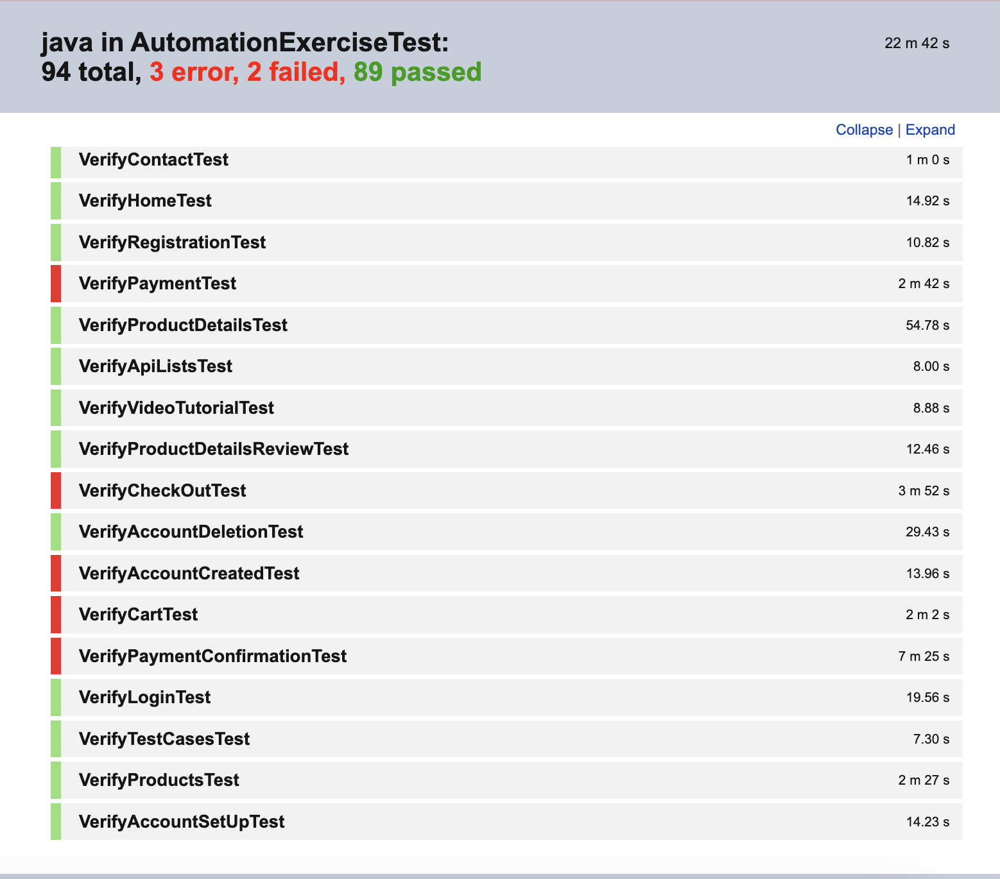
   *First execution report from IntelliJ IDEA*

2. [Second IDE Run Report](https://abiolaah.github.io/AutomationExerciseTest/ide-reports/second-ide-run.html)
   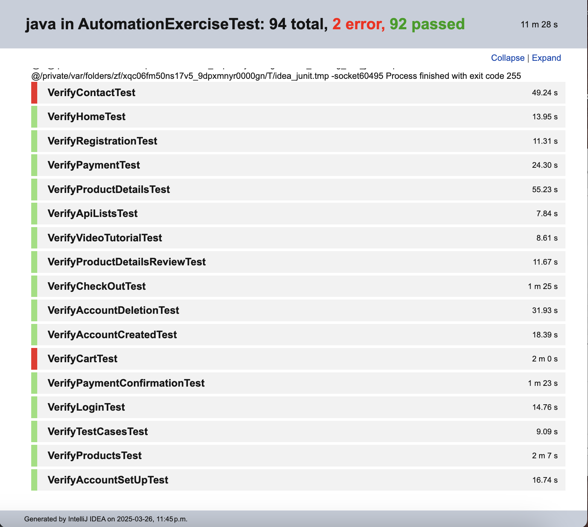
   *Second execution report showing improved success rate*

3. [Third IDE Run Report](https://abiolaah.github.io/AutomationExerciseTest/ide-reports/third-ide-run.html)
   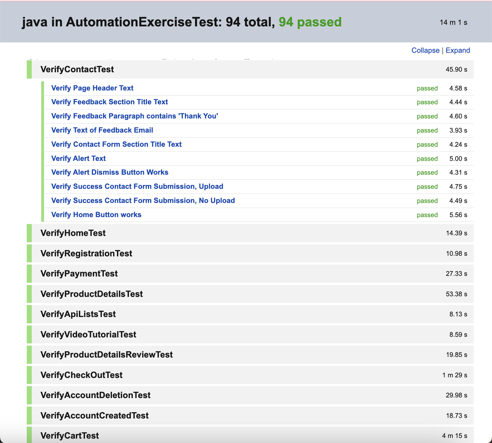
   *Final execution report with all tests passing*

**View All Reports:**
[Complete Test Results Dashboard](https://abiolaah.github.io/AutomationExerciseTest/)


## Screenshots
*Some Screenshot of the test*
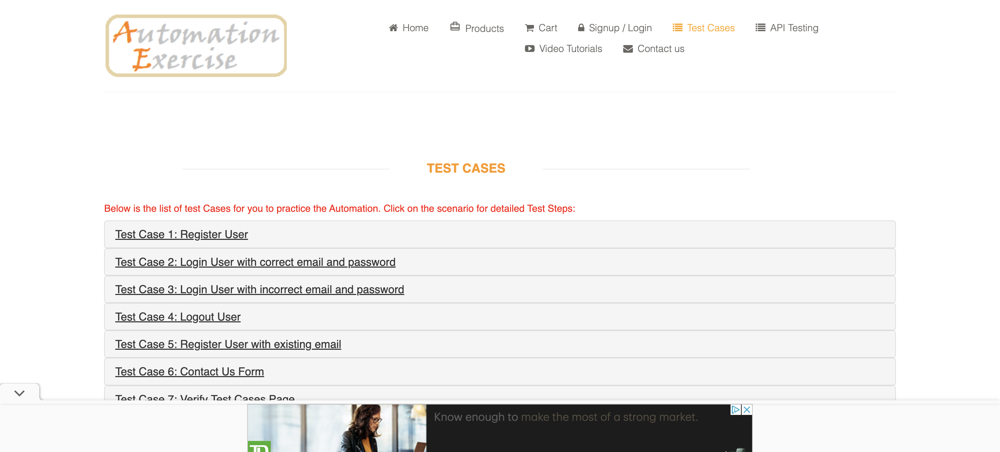
*Figure 1: Test Case Page Verification*

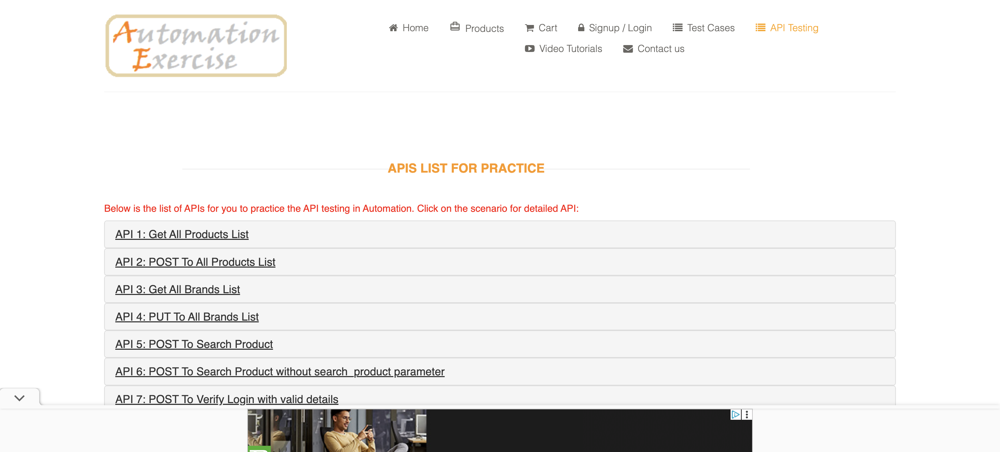
*Figure 2: API List Page Header Verification*

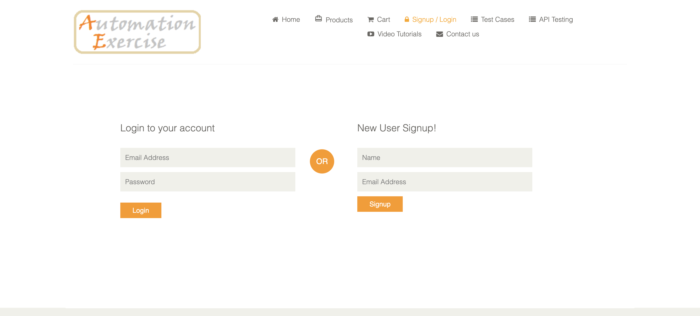
*Figure 3: Checkout Process Flow*

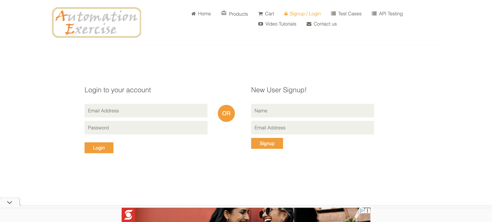
*Figure 4: User Authentication Test*

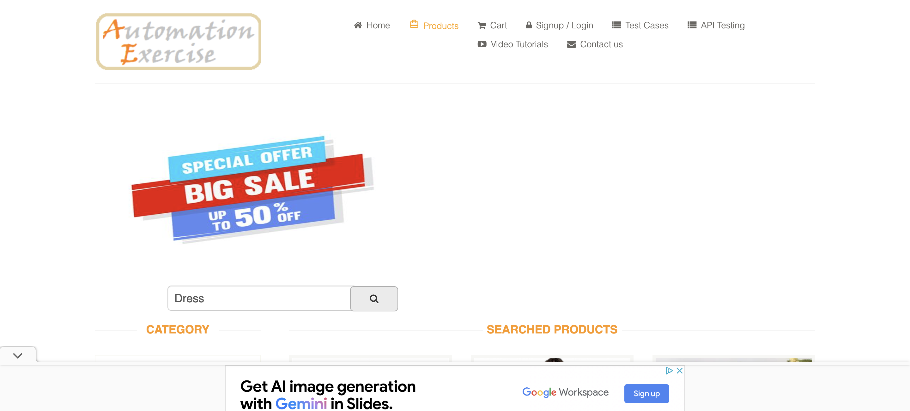
*Figure 5: Product Search Results*

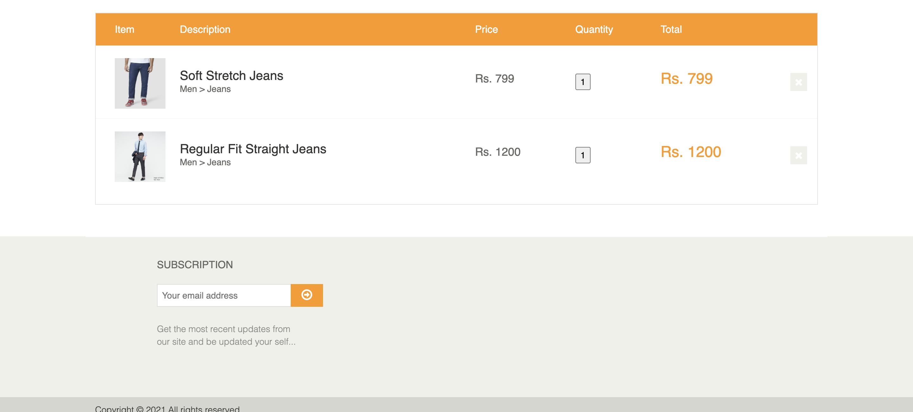
*Figure 6: Shopping Cart Summary*
<!-- AUTO-GENERATED SCREENSHOTS END -->

## Contributions
Contributions are welcome! If you encounter any issues or have suggestions for improvements, feel free to submit a pull request or open an issue in the repository

## License
This project is licensed under the MIT License. See the LICENSE file for more details.


**Enjoy testing the Automation Exercise website!**